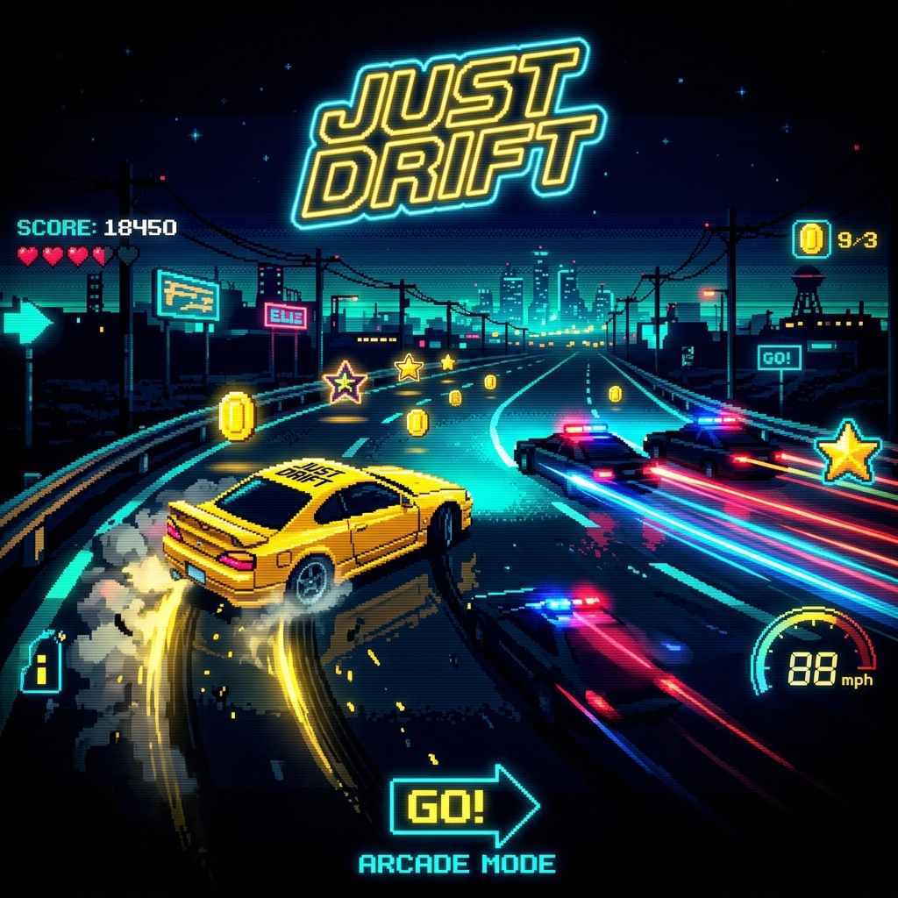

# Just Drift 🏎️

<p align="center">
  
</p>

## Overview

**OUTRUN THE COPS. DRIFT TO SURVIVE.** A fast-paced, top-down **8-bit arcade chase game** with a unique laptop-display + phone-controller architecture. Players use their phone as a gamepad connected via WebSocket while the game renders on their laptop/TV screen. Features smart AI police, power-ups, shooting mechanics, and retro pixel art with CRT effects.

---

## 🎮 Play Now

🔗 **[Play Now](https://jdrift.buildsrivatsa.qzz.io)** | 📱 **[Controller](https://jdrift.buildsrivatsa.qzz.io/controller)**

---

## Key Features

- **Phone as Controller** — Touch-optimized mobile gamepad with haptic feedback
- **8-bit Retro Aesthetic** — CRT scanlines, pixel art, synthwave palette
- **6 Power-ups** — Shield, Machine Gun, EMP, Infinite Nitro, Coin Magnet, Nitro Refill
- **Smart AI Police** — Increasingly aggressive pursuit behavior
- **8-bit Audio** — Procedural sound effects via Web Audio API
- **Room-based Multiplayer** — 4-digit PIN code matchmaking
- **Docker-ready** — Production deployment with Nginx + Cloudflare

---

## Technology Stack

| Technology | Purpose |
|---|---|
| Node.js 18+ | Server runtime |
| Express.js | HTTP server |
| Socket.IO 4.x | Real-time WebSocket communication |
| HTML5 Canvas | Game rendering |
| Web Audio API | 8-bit sound effects |
| Docker | Containerized deployment |
| Nginx | Reverse proxy |
| Cloudflare | DNS + SSL + CDN |

---

## Installation & Setup

```bash
git clone https://github.com/srivatsacool/just_drift.git
cd just_drift
npm install
npm start
```

---

## Author

**Srivatsa Gorti** — [Build.Srivatsa](https://github.com/srivatsacool)

---
