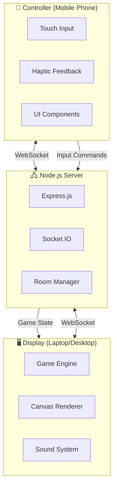
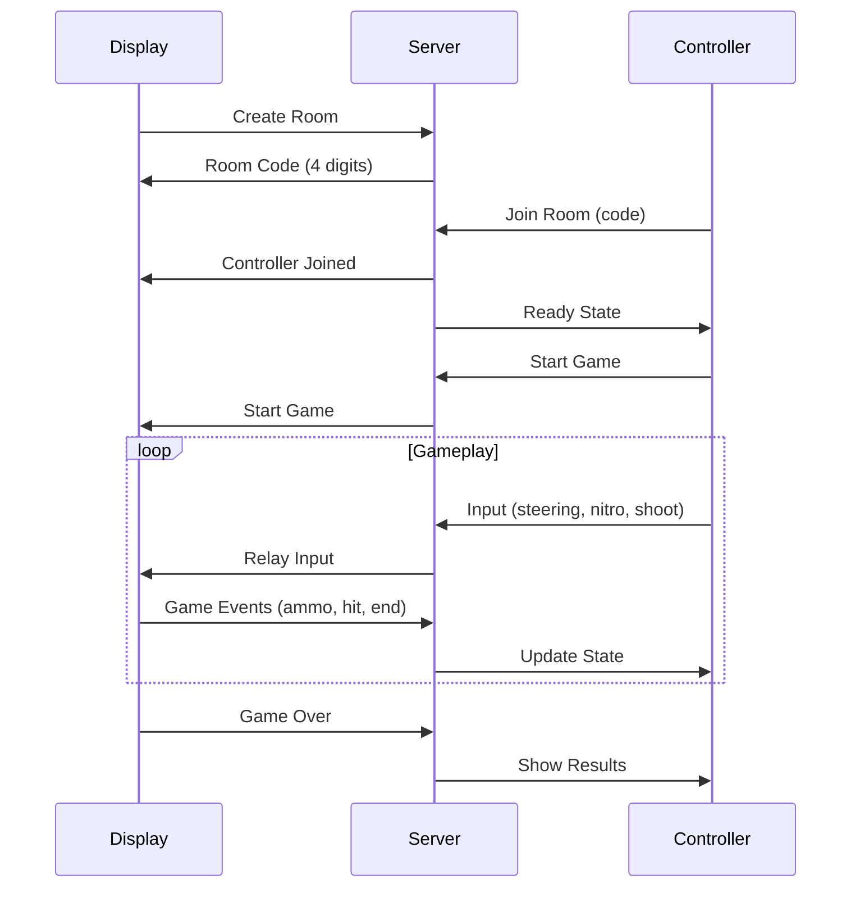

# 🏎️ JUST DRIFT

<div align="center">


### **OUTRUN THE COPS. DRIFT TO SURVIVE.**

*A top-down 8-bit arcade chase game with mobile controller support*

[](https://nodejs.org)
[](https://socket.io)
[](LICENSE)
[](https://github.com/build-srivatsa)

</div>

---

## 📖 Table of Contents

- [🎮 About the Game](#-about-the-game)
- [✨ Features](#-features)
- [🏗️ Architecture](#️-architecture)
- [🚀 Quick Start](#-quick-start)
- [🎯 How to Play](#-how-to-play)
- [💥 Power-ups](#-power-ups)
- [📱 Controller Features](#-controller-features)
- [🖥️ Display Features](#️-display-features)
- [📁 Project Structure](#-project-structure)
- [🎨 Visual Design](#-visual-design)
- [🔧 Configuration](#-configuration)
- [🌐 Deployment](#-deployment)
- [🤝 Credits](#-credits)

---

## 🎮 About the Game

**Just Drift** is a fast-paced, top-down 8-bit arcade chase game where you play as a thief in a getaway car being pursued by relentless police!

### 🎲 Game Concept

| Aspect | Description |
|--------|-------------|
| **Style** | Top-down 8-bit arcade (retro pixel art) |
| **Theme** | High-speed police chase |
| **Objective** | Survive as long as possible, collect coins, use power-ups |
| **Input** | Laptop/Desktop as display + Mobile phone as controller |

---

## ✨ Features

### 🎮 Core Gameplay
- ⚡ **Fast-paced chase mechanics** with smart AI police
- 🚗 **Smooth drifting physics** for tight cornering
- 💰 **Coin collection system** for higher scores
- 🔫 **Shooting mechanics** to destroy police cars
- ⏸️ **Pause functionality** from controller
- 🏆 **Score tracking** based on time and coins

### 🌟 Power-up System
- 🛡️ **Shield** - Temporary invincibility
- 🔫 **Machine Gun** - Rapid-fire mode
- 💥 **EMP Blast** - Destroy all visible police cars
- ⚡ **Infinite Nitro** - Unlimited boost
- 🧲 **Coin Magnet** - Attract nearby coins

### 📱 Mobile Controller
- 🕹️ Touch-optimized controls
- 📳 Haptic feedback for immersion
- 🎯 Ready screen with START button
- 🔄 Auto-reconnection on disconnect
- 📊 Real-time ammo and nitro display

### 🖥️ Display Features
- 🎨 8-bit retro pixel art visuals
- 🔊 Sound effects and sirens
- 📺 Beautiful overlay screens
- 📝 QR code for easy controller connection
- ⏱️ Real-time HUD with score and time

---

## 🏗️ Architecture



### 🔄 Data Flow



---

## 🚀 Quick Start

### Prerequisites
- Node.js 18+
- npm or yarn

### Installation

```bash
# Clone the repository
git clone https://github.com/build-srivatsa/just-drift.git

# Navigate to project directory
cd just-drift

# Install dependencies
npm install

# Start the server
npm start
```

### Running the Game

1. **Start the server:**
   ```bash
   npm start
   # or for development with nodemon
   npm run dev
   ```

2. **Open the Display:**
   - Navigate to `http://localhost:3000/display` on your laptop/desktop
   - A 4-digit room code will appear

3. **Connect the Controller:**
   - Open `http://localhost:3000/controller` on your mobile phone
   - Enter the 4-digit room code
   - Tap the **START** button to begin!

---

## 🎯 How to Play

### 📱 Controller Layout

```
┌─────────────────────────────────────────┐
│           [AMMO: 5]  [NITRO: ████]      │
├─────────────────────────────────────────┤
│                                         │
│  ┌───────┐    ┌───────┐    ┌───────┐   │
│  │       │    │  ⚡   │    │       │   │
│  │   ◀   │    │ NITRO │    │   ▶   │   │
│  │ LEFT  │    │       │    │ RIGHT │   │
│  │       │    ├───────┤    │       │   │
│  │       │    │  💥   │    │       │   │
│  │       │    │ FIRE  │    │       │   │
│  └───────┘    └───────┘    └───────┘   │
│                                         │
└─────────────────────────────────────────┘
```

### 🎮 Controls

| Button | Action | Description |
|--------|--------|-------------|
| **◀ LEFT** | Steer Left | Move car to the left |
| **▶ RIGHT** | Steer Right | Move car to the right |
| **⚡ NITRO** | Hold to Boost | Speed boost (consumes nitro) |
| **💥 FIRE** | Shoot | Fire bullets at police (uses ammo) |
| **⏸️ PAUSE** | Pause Game | Pause/Resume the game |

### 🏁 Gameplay Tips

1. **Collect coins** 💰 - They give bonus points and refill resources
2. **Use nitro wisely** - Save it for tight escapes
3. **Aim for power-ups** - They spawn every 4 seconds
4. **Destroy police cars** - Each destruction gives 100 points
5. **Watch your ammo** - Coins refill your ammo

---

## 💥 Power-ups

Power-ups spawn every **4 seconds** and provide temporary abilities:

| Power-up | Icon | Duration | Effect |
|----------|------|----------|--------|
| **Shield** | 🛡️ | 5 seconds | Invincibility - collisions destroy police instead |
| **Machine Gun** | 🔫 | 5 seconds | Rapid fire - shoot continuously |
| **EMP Blast** | 💥 | Instant | Destroys ALL visible police cars |
| **Infinite Nitro** | ⚡ | 5 seconds | Unlimited nitro boost |
| **Coin Magnet** | 🧲 | 10 seconds | Attracts nearby coins automatically |

### Power-up Spawn Locations
- Random positions ahead of the player
- Within the road boundaries
- Maximum 2 power-ups on screen at once

---

## 📱 Controller Features

### 🎨 Arcade Frame UI
The controller features a beautiful **purple neon arcade frame** design:
- Gradient dark background
- Purple glow border effect
- Inner screen glow
- Racing stripes on logo

### 📱 Ready Screen
When connected, a dedicated ready screen appears with:
- Big green **START** button
- Room code display
- Pulsing animations
- Car driving animation

### 📳 Haptic Feedback
Different vibration patterns for:
- Button presses (30ms)
- Shooting (80ms-120ms recoil pattern)
- Hit confirmation (100ms-50ms-100ms success pattern)
- Game over (200ms-100ms-400ms pattern)

---

## 🖥️ Display Features

### 📺 Game Screens

1. **Title Screen** - Game logo and waiting state
2. **Waiting Screen** - Room code + QR code for quick connection
3. **Ready Screen** - Controller connected, waiting to start
4. **Playing** - Main gameplay with HUD
5. **Pause Screen** - Paused state with resume option
6. **Game Over** - Final score and retry option

### 🎛️ HUD Elements
- **Time** - Elapsed game time
- **Score** - Current points
- **Ammo** - Bullets remaining
- **Nitro Bar** - Nitro level display

---

## 📁 Project Structure

```
just-drift/
├── 📄 server.js              # Node.js + Express + Socket.IO server
├── 📄 package.json           # Dependencies and scripts
├── 📄 ecosystem.config.js    # PM2 production configuration
├── 📄 nginx.conf.example     # Nginx reverse proxy template
├── 📄 README.md              # This file
│
├── 📂 public/
│   ├── 📄 index.html         # Home page with menu
│   ├── 🖼️ bg_2.jpeg          # Background image
│   │
│   ├── 📂 display/           # Display client (laptop/desktop)
│   │   ├── 📄 index.html     # Display HTML
│   │   ├── 📄 game.js        # Game engine (1500+ lines)
│   │   └── 📄 style.css      # Display styles
│   │
│   └── 📂 controller/        # Controller client (mobile)
│       ├── 📄 index.html     # Controller HTML
│       ├── 📄 controller.js  # Input handling
│       ├── 📄 style.css      # Base styles
│       └── 📄 arcade-theme.css  # Arcade frame UI
│
├── 🖼️ just_drift_2.jpeg      # Car showcase image
├── 🖼️ controller.jpeg        # Controller preview
└── 🖼️ bg.jpeg                # Alternative background
```

---

## 🎨 Visual Design

### 🎨 Color Palette

| Element | Color | Hex |
|---------|-------|-----|
| **Background** | Dark Black | `#0a0a0f` |
| **Road** | Dark Gray | `#2d2d3a` |
| **Player Car** | Yellow | `#ffd166` |
| **Police Car** | Blue | `#2196f3` |
| **Siren Red** | Bright Red | `#ff1744` |
| **Siren Blue** | Cyan | `#00e5ff` |
| **Coins** | Gold | `#ffd700` |
| **UI Accent** | Teal | `#4ecdc4` |
| **Power-up Glow** | Various | Per type |

### ✨ Visual Effects
- Pixelated 8-bit rendering
- Police siren animations (red/blue alternating)
- Road scrolling with painted lines
- Coin collection sparkles
- Power-up pulsing glow
- Explosion particles

---

## 🔧 Configuration

### Environment Variables

| Variable | Default | Description |
|----------|---------|-------------|
| `PORT` | 3000 | Server port |
| `NODE_ENV` | development | Environment mode |

### Game Configuration

Edit `public/display/game.js` to adjust gameplay:

```javascript
const CONFIG = {
  // Player settings
  PLAYER_BASE_SPEED: 4,        // Base car speed
  PLAYER_NITRO_MULT: 1.8,      // Nitro speed multiplier
  PLAYER_MAX_NITRO: 100,       // Maximum nitro amount
  PLAYER_NITRO_DRAIN: 0.5,     // Nitro drain rate
  
  // Police settings
  POLICE_BASE_SPEED: 2.5,      // Police car speed
  POLICE_MAX_COUNT: 5,         // Maximum police cars
  POLICE_SPAWN_DELAY: 3000,    // Ms between spawns
  
  // Game settings
  SCORE_PER_SECOND: 10,        // Points per second
  COIN_VALUE: 50,              // Points per coin
  KILL_SCORE: 100,             // Points per police destroyed
  
  // Power-up timing
  POWERUP_SPAWN_INTERVAL: 4000 // Ms between power-up spawns
};
```

---

## 🌐 Deployment

### Production with PM2

```bash
# Install PM2 globally
npm install -g pm2

# Start the app
pm2 start ecosystem.config.js --env production

# Save PM2 list
pm2 save

# Setup startup script
pm2 startup
```

### Nginx Configuration

See `nginx.conf.example` for a complete template with:
- HTTPS/SSL termination
- WebSocket proxy
- Static file caching

### Cloudflare Setup

1. Set SSL mode to **Full (Strict)**
2. Enable WebSocket support (enabled by default)
3. Create A-record pointing to server IP with **Proxy enabled**

---

## 📊 Technical Specifications

| Aspect | Specification |
|--------|---------------|
| **Engine** | Vanilla JavaScript Canvas |
| **Server** | Node.js + Express.js |
| **Real-time** | Socket.IO 4.x |
| **Styling** | Pure CSS (no frameworks) |
| **Font** | Press Start 2P (8-bit style) |
| **Target FPS** | 60 FPS |
| **Min Browser** | Chrome 80+, Firefox 75+, Safari 13+ |

---

## 🤝 Credits

<div align="center">

### Built with ❤️ by **Build.Srivatsa**

Part of the arcade game collection using the innovative **laptop-display + phone-controller** architecture.

*Inspired by classic arcade chase games and modern mobile gaming*

</div>

---

## 📄 License

This project is licensed under the MIT License - see the [LICENSE](LICENSE) file for details.

---

<div align="center">

**🏎️ JUST DRIFT 🏎️**

*Can you outrun the cops?*

</div>
# just_drive_vide_coded

