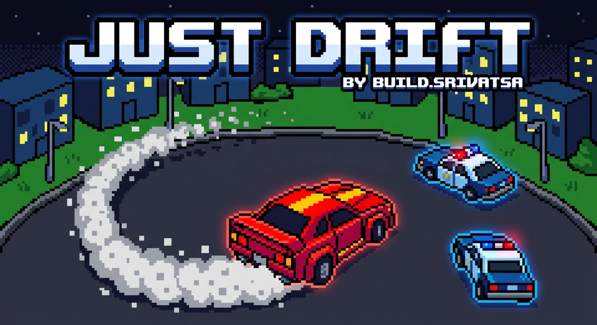

# 🏎️ JUST DRIFT

<div align="center">



### **OUTRUN THE COPS. DRIFT TO SURVIVE.**

*A top-down 8-bit arcade chase game with mobile controller support*

[](https://nodejs.org)
[](https://socket.io)
[](LICENSE)
[](https://github.com/build-srivatsa)

</div>

---

## 📖 Table of Contents

- [🎮 About the Game](#-about-the-game)
- [✨ Features](#-features)
- [🚀 Quick Start](#-quick-start)
- [🎯 How to Play](#-how-to-play)
- [💥 Power-ups](#-power-ups)
- [📱 Controller Features](#-controller-features)
- [🖥️ Display Features](#️-display-features)
- [📁 Project Structure](#-project-structure)
- [🔧 Configuration](#-configuration)
- [🤝 Credits](#-credits)

---

## 🎮 About the Game

**Just Drift** is a fast-paced, top-down 8-bit arcade chase game where you play as a thief in a getaway car being pursued by relentless police!

| Aspect | Description |
|--------|-------------|
| **Style** | Top-down 8-bit arcade (retro pixel art) |
| **Theme** | High-speed police chase |
| **Objective** | Survive as long as possible, collect coins, use power-ups |
| **Input** | Laptop/Desktop as display + Mobile phone as controller |

---

## ✨ Features

### 🎮 Core Gameplay
- ⚡ **Fast-paced chase mechanics** with smart AI police
- 🚗 **Smooth driving physics** with nitro boost
- 💰 **Coin collection system** for higher scores
- 🔫 **Shooting mechanics** to destroy police cars
- ⏸️ **Pause functionality** from both display and controller
- 🏆 **High score tracking** saved locally
- 🔄 **Retry system** on both interfaces

### 🌟 Power-up System (6 Types)
- 🛡️ **Shield** - Temporary invincibility (5s)
- 🔫 **Machine Gun** - Rapid-fire mode (5s)
- 💥 **EMP Blast** - Destroy all visible police cars (instant)
- ⚡ **Infinite Nitro** - Unlimited boost (5s)
- 🧲 **Coin Magnet** - Attract nearby coins (10s)
- ⛽ **Nitro Refill** - Instantly refills nitro to 100% (spawns 5x more frequently)

### 📱 Mobile Controller
- 🕹️ Touch-optimized large buttons
- 📳 Haptic feedback for immersion
- 📊 Real-time ammo and nitro display
- ⏸️ Pause button in HUD
- 🔄 Retry button on game over
- 🎨 8-bit arcade visual theme

### 🖥️ Display Features
- 🎨 8-bit retro pixel art visuals
- 📺 CRT scanline effects
- 🔊 8-bit sound effects
- 📝 QR code for easy controller connection
- ⏱️ Real-time HUD with score, time, ammo, nitro
- ⏸️ Pause button + keyboard shortcuts (P / Escape)

---

## 🚀 Quick Start

### Prerequisites
- Node.js 18+
- npm

### Installation

```bash
# Clone the repository
git clone https://github.com/build-srivatsa/just-drift.git

# Navigate to project directory
cd just-drift

# Install dependencies
npm install

# Start the server
npm start
```

### Running the Game

1. **Start the server:**
   ```bash
   npm start
   # Server runs on http://localhost:3000 (or PORT env variable)
   ```

2. **Open the Display:**
   - Navigate to `http://localhost:3000/display` on your laptop/desktop
   - A 4-digit room code will appear

3. **Connect the Controller:**
   - Open `http://localhost:3000/controller` on your mobile phone
   - Enter the 4-digit room code
   - Tap **FIRE** on controller to start!

---

## 🎯 How to Play

### 📱 Controller Layout (Landscape Mode)

```
┌─────────────────────────────────────────────────────┐
│  [AMMO: 50]  [N2O: ████████]              [⏸]      │
├─────────────────────────────────────────────────────┤
│                                                     │
│  ┌─────────────┐  ┌─────────────┐   ┌───────────┐  │
│  │             │  │             │   │    🔫     │  │
│  │      ◀      │  │      ▶      │   │   FIRE    │  │
│  │    LEFT     │  │    RIGHT    │   ├───────────┤  │
│  │             │  │             │   │    ⚡     │  │
│  │             │  │             │   │   NITRO   │  │
│  └─────────────┘  └─────────────┘   └───────────┘  │
│                                                     │
└─────────────────────────────────────────────────────┘
```

### 🎮 Controls

| Button | Action | Description |
|--------|--------|-------------|
| **◀ LEFT** | Steer Left | Hold to move car left |
| **▶ RIGHT** | Steer Right | Hold to move car right |
| **⚡ NITRO** | Hold to Boost | Speed boost (drains nitro bar) |
| **🔫 FIRE** | Shoot | Fire bullets at police |
| **⏸ PAUSE** | Pause/Resume | Pause the game |

### ⌨️ Keyboard Controls (Display)

| Key | Action |
|-----|--------|
| **P** | Pause/Resume |
| **Escape** | Pause/Resume |

### 🏁 Gameplay Tips

1. **Collect coins** 💰 - They give bonus points
2. **Use nitro wisely** - It refills automatically when not in use
3. **Aim for power-ups** - They spawn every 4 seconds
4. **Look for cyan power-ups (⛽)** - They instantly refill your nitro!
5. **Destroy police cars** - Each destruction gives 500 points

---

## 💥 Power-ups

Power-ups spawn every **4 seconds** (max 2 on screen):

| Power-up | Icon | Color | Duration | Effect |
|----------|------|-------|----------|--------|
| **Shield** | 🛡️ | Teal | 5s | Invincibility |
| **Machine Gun** | 🔫 | Red | 5s | Rapid fire |
| **EMP Blast** | 💥 | Yellow | Instant | Destroy all police |
| **Infinite Nitro** | ⚡ | Green | 5s | Unlimited boost |
| **Coin Magnet** | 🧲 | Purple | 10s | Attract nearby coins |
| **Nitro Refill** | ⛽ | Cyan | Instant | Refill nitro to 100% |

> **Note:** Nitro Refill spawns **5x more frequently** than other power-ups!

---

## 📱 Controller Features

### 🎨 8-Bit Arcade Design
- CRT scanline overlay
- Neon color scheme (cyan, yellow, red, green)
- Pixel font (Press Start 2P)
- Dark arcade cabinet aesthetic

### 📳 Haptic Feedback
| Event | Vibration |
|-------|-----------|
| Button press | 20-50ms |
| Shooting | 50ms |
| Game over | 300ms |
| Nitro refill | 100ms |

### 🎮 Game Over Overlay
When busted, the controller shows:
- Flashing police lights (red/blue)
- "BUSTED!" title
- Final score
- **RETRY** button

---

## 🖥️ Display Features

### 📺 Game Screens

1. **Title Screen** - Loading animation
2. **Waiting Screen** - Room code + QR code
3. **Ready Screen** - "READY?" with START button
4. **Playing** - Main gameplay with HUD
5. **Pause Screen** - Resume/Quit options
6. **Game Over** - Score, High Score, Retry button

### 🎛️ HUD Elements
- **SCORE** - Current points
- **TIME** - Elapsed game time
- **N2O** - Nitro bar (changes color when low)
- **AMMO** - Bullets remaining
- **⏸** - Pause button

### 🏆 High Score
- Saved to browser localStorage
- Displayed on game over screen
- Persists across sessions

---

## 📁 Project Structure

```
just-drift/
├── 📄 server.js              # Node.js + Express + Socket.IO
├── 📄 package.json           # Dependencies
├── 📄 README.md              # This file
│
├── 📂 public/
│   ├── 📄 index.html         # Home page
│   ├── 🖼️ bg_2.jpeg          # Background image
│   │
│   ├── 📂 display/           # Game display (laptop/desktop)
│   │   ├── 📄 index.html     # Display HTML
│   │   ├── 📄 game.js        # Game engine (~1600 lines)
│   │   └── 📄 style.css      # Display styles
│   │
│   └── 📂 controller/        # Controller (mobile phone)
│       ├── 📄 index.html     # Controller HTML
│       ├── 📄 controller.js  # Input handling
│       └── 📄 style.css      # Controller styles
│
└── 🖼️ just_drift_2.jpeg      # Logo image
```

---

## 🔧 Configuration

### Environment Variables

| Variable | Default | Description |
|----------|---------|-------------|
| `PORT` | 3000 | Server port |

### Game Configuration

Edit `public/display/game.js` CONFIG object:

```javascript
const CONFIG = {
  // Player
  PLAYER_BASE_SPEED: 5,
  PLAYER_MAX_SPEED: 8,
  PLAYER_TURN_SPEED: 0.055,
  
  // Police
  POLICE_BASE_SPEED: 3,
  POLICE_MAX_COUNT: 6,
  POLICE_SPAWN_DELAY: 4000,
  
  // Coins
  COIN_SCORE: 150,
  COIN_SPAWN_DELAY: 2000,
  
  // Scoring
  SCORE_PER_SECOND: 10
};
```

---

## 📊 Technical Specifications

| Aspect | Specification |
|--------|---------------|
| **Engine** | Vanilla JavaScript Canvas 2D |
| **Server** | Node.js + Express.js |
| **Real-time** | Socket.IO 4.x |
| **Styling** | Pure CSS (no frameworks) |
| **Font** | Press Start 2P (Google Fonts) |
| **Target FPS** | 60 FPS |
| **Browser Support** | Chrome 80+, Firefox 75+, Safari 13+, Edge 80+ |

---

## 🤝 Credits

<div align="center">

### Built with ❤️ by **Build.Srivatsa**

*A modern arcade game using the innovative laptop-display + phone-controller architecture*

---

### 📄 License

This project is open source and available for personal use and modification.

---

**🏎️ JUST DRIFT 🏎️**

*Can you outrun the cops?*

</div>